# Automatic Emergency Braking
---

## Automatic Emergency Braking (AEB)

Automatic Emergency Braking (AEB) is a safety feature available in many modern vehicles. It's designed to detect an impending collision and, if necessary, apply the brakes to prevent or reduce the severity of a crash.

### How does it work?

AEB systems use sensors, cameras, radar, and lidar technology to monitor the vehicle's surroundings and detect potential obstacles. When the system determines that a collision is imminent:

1. It alerts the driver with audible and visual warnings.
2. If the driver doesn't take action promptly, the system can automatically apply the brakes.

Nissan AEB 
---
[](https://youtu.be/OyfPrEnAwdg)


### Benefits

- **Safety**: AEB can help prevent accidents or reduce their severity, thus protecting passengers, drivers, and pedestrians.
- **Reduced Driver Stress**: It serves as an extra set of eyes, providing an additional layer of security.
- **Potential Insurance Savings**: Some insurance companies offer discounts for vehicles equipped with AEB.

<figure class="aligncenter">
    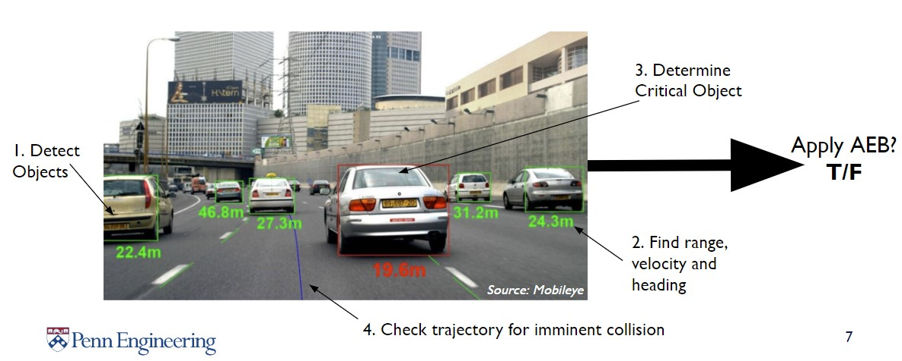
    <figcaption>Radar Calibrated Vision Pipeline - Binary Classifier</figcaption>
</figure>

### Limitations

- **Sensor Limitations**: AEB might not detect obstacles if the sensors are dirty or covered.
- **Weather Conditions**: Heavy rain, fog, or snow can reduce the system's effectiveness.
- **No Replacement for Driver Vigilance**: AEB is a supplemental system, and drivers should always be attentive and ready to take control.

<figure class="aligncenter">
    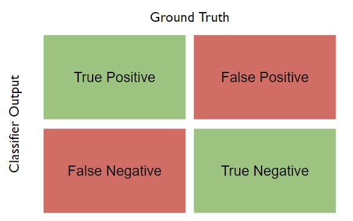
    <figcaption>Classifications</figcaption>
</figure>

### Future of AEB

With advancements in AI and sensor technology, the efficiency and reliability of AEB systems are expected to improve. They may also integrate with other vehicle systems for a more holistic safety approach, such as connecting with vehicle-to-vehicle (V2V) communication systems.

AEB Videos 
---
[](https://youtu.be/815fsWXerIg)

[](https://youtu.be/bUhFfunT2ds)

Tesla Crash in China 
---
[](https://youtu.be/fc0yYJ8-Dyo)

Uber Self Driving Car Crash
---
[](https://youtu.be/NJeQ0Dj4jAE)


## **NTSB Report Summary: Uber Autonomous Vehicle Crash in Tempe, Arizona**

### **Background**
- **Date:** March 18, 2018
- **Location:** Tempe, Arizona
- **Incident:** An autonomous test vehicle operated by Uber struck and killed a pedestrian.

### **Key Findings**

1. **Vehicle's Perception System:** 
    - The vehicle's radar and LIDAR sensors detected the pedestrian 6 seconds before the impact.
    - However, the system did not classify her as a pedestrian, because she was crossing a street at a location without a crosswalk.
    - The system struggled to predict her path, considering her as an unknown object, a vehicle, and then as a bicycle, leading to delays in the decision-making process.

2. **Emergency Braking:**
    - The self-driving system was designed not to initiate emergency braking on its own.
    - It relied on the human backup driver to intervene. However, the system did not alert the driver to do so.

3. **Backup Driver:**
    - The driver was found to be distracted and not watching the road. 
    - The interior camera showed the driver was looking down at a personal device multiple times before the crash.
    - The NTSB highlighted the inadequacy of Uber's oversight in ensuring drivers followed company policies on attentiveness.

4. **Pedestrian Behavior:** 
    - The pedestrian was found to have methamphetamine and marijuana in her system, which could have impaired her ability to judge the distance and speed of the oncoming vehicle.
    - She did not look in the direction of the vehicle until just before impact.

5. **Recommendations:**
    - Stronger guidelines for the testing of autonomous vehicles on public roads.
    - Better oversight of backup drivers to ensure attentiveness.
    - Enhanced safety systems that can initiate emergency braking when needed, without relying solely on human intervention.

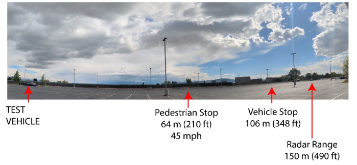
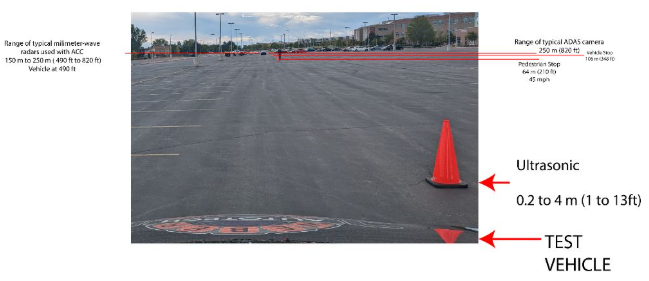 

## Euclidean Distance vs Time to Collision

1. Euclidean Distance:
Euclidean distance is the straight-line distance between two points in Euclidean space. It's the most common way to calculate the "ordinary" distance between two points.

2. Time to Collision (TTC):
TTC is a measure of time. Specifically, it estimates the amount of time it will take for two objects to collide if they continue on their current trajectories at their current speeds. The formula for TTC can be based on the range-rate, which is the rate at which the distance between the two objects is changing.

### Comparison:

#### Nature
- Euclidean distance is a spatial metric that quantifies the "separation" between two points in space.
TTC is a temporal metric that quantifies the "separation" in time before a potential collision.

#### Units:
- Euclidean distance is typically measured in spatial units like meters, kilometers, etc.
TTC is measured in time units like seconds.

#### Application:
- Euclidean distance is commonly used in geometry, computer graphics, machine learning (for clustering, classification, etc.), and many other fields.
TTC is specifically used in safety-critical applications like collision avoidance systems in vehicles, drones, and other moving platforms.

#### Interdependence:
- While they are distinct concepts, they can be related. For example, if you know the Euclidean distance between two moving objects and their relative velocity, you can compute the TTC. Conversely, if you know the TTC and the relative velocity, you can infer the Euclidean distance at which the objects will collide if no actions are taken.

In summary, while both Euclidean distance and TTC can provide insights into the relationship between two entities (points or objects), one is spatial, and the other is temporal. They are used in different contexts but can be interconnected in applications like collision avoidance.

## Time to Collision (TTC)

"Time to Collision" (TTC) is a measure used in traffic safety to estimate the time it will take for two objects (usually vehicles) to collide if they continue on their current paths at their current speeds. It's a useful metric, especially for driver assistance systems and autonomous vehicles, to evaluate the safety of a given traffic scenario.

<figure class="aligncenter">
    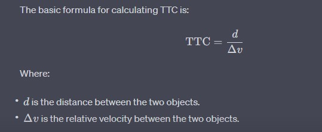
    <figcaption>Time To Collision (TTC)</figcaption>
</figure>

If the two objects are moving directly towards each other, &Delta; v  is simply the sum of their velocities. If they are moving in the same direction, &Delta; v is the difference in their velocities.

### Example:

Consider two cars:
- Car A is stationary.
- Car B is moving towards Car A at a speed of 20 m/s.
- The distance between them is 100 meters.

Given the scenario, the TTC is:

<figure class="aligncenter">
    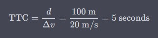
    <figcaption>Time To Collision (TTC) Example</figcaption>
</figure>

It means that if Car B continues at its current speed without slowing down or changing its path, it will collide with Car A in 5 seconds.

```note
The above calculation assumes constant speeds and straight-line paths. In real-world scenarios where speeds and directions can change, the calculation becomes more complex. Advanced driver assistance systems and autonomous vehicles use sophisticated algorithms and sensors to estimate TTC in dynamic environments.
```

## Time to Collision using laser data

Let's break it down:

1. Suppose you have two objects: Object A (e.g., your vehicle) and Object B (e.g., another vehicle or obstacle).
2. Let V be the relative velocity of Object A with respect to Object B.
3. Let θ be the angle between the direction of V and the line-of-sight (direct path) between Object A and Object B.

The component of V that is directly along the line-of-sight is given by Vcos(θ). This component is called the "range-rate," and it represents how fast the distance between the two objects is changing.

### Time to Collision (TTC) using Vcos(θ):
Given:
- R: Current distance between Object A and Object B.
- R=Vcos(θ): Range-rate or the rate at which the distance between the two objects is changing.
The TTC can be calculated as:

<figure class="aligncenter">
    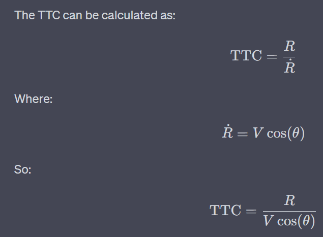
    <figcaption>Time To Collision (TTC) Range Rate</figcaption>
</figure>

​
```note
This formula allows you to compute the time it will take for Object A to reach Object B (or vice versa) based on their relative velocity and the angle of approach. Again, it assumes that both objects continue on their current paths at their current speeds without any changes.
```


## Planar Lidar

A planar LiDAR (Light Detection and Ranging) is a device that uses laser light to measure distances to objects in a 2-dimensional plane. It operates by sending out laser beams and then measuring the time it takes for the light to be reflected back to the sensor. Here's a breakdown of how a planar LiDAR is used to detect the distance to an object:

1. Emission of Laser Beams:
- The LiDAR emits a laser beam in a specific direction.
- The beam travels outward until it encounters an obstacle or object and gets reflected back.

<figure class="aligncenter">
    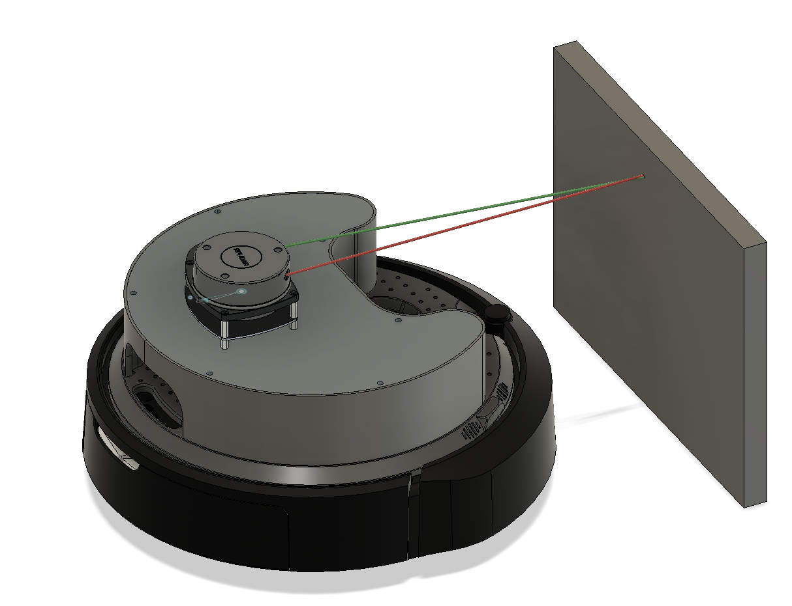
    <figcaption>Planar Lidar (RPILidar laserscan)</figcaption>
</figure>

2. Detection of Reflected Light:
- A detector in the LiDAR system captures the reflected light.
- The time between the emission of the laser pulse and the detection of the reflected light is recorded.

3. Distance Calculation:
- The speed of light is constant. Given this, the distanced to the object can be determined using the formula:

<figure class="aligncenter">
    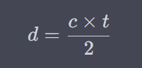
    <figcaption>Distance to Object Calculation</figcaption>
</figure>
<div align="center">
<p>Where:</p>
<p>- c = speed of light (approximately 3 × 10 <sup>8</sup> meters per second)</p>
<p>- t = time taken for the laser beam to travel to the object and back</p>
<p>- The division by 2 accounts for the round-trip distance (to the object and back).</p>
</div>

4. Scanning Mechanism:
- While the basic principle described above gets the distance to a single point, a planar LiDAR typically has a mechanism to rotate or oscillate the laser emitter and detector assembly.
- This allows the LiDAR to scan its surroundings in a planar fashion, generating a 2D "map" of distances at various angles.
- The result is typically called a "scan" or "profile", which is a set of distance values corresponding to various angles around the LiDAR.

5. Data Interpretation:
- The raw data from the LiDAR can be processed to detect objects, measure their distance, and determine their shape (at least in the plane of the LiDAR's scan).
- Algorithms can be applied to segment this data, distinguishing between different objects, and even estimating the size or orientation of detected objects.

<figure class="aligncenter">
    
    <figcaption>This image shows the different variables stored in the Turtlebot4 LaserScan Messages</figcaption>
 </figure>

 <figure>   
    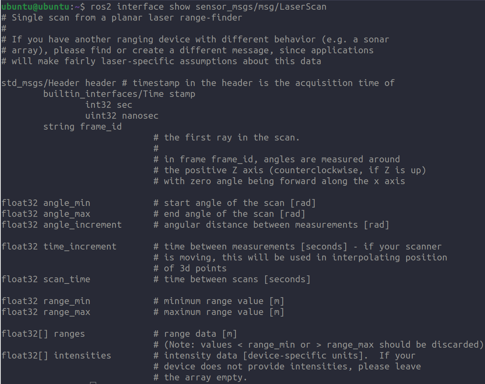
    <figcaption>Stored values for LaserScan message for Turtlebot4</figcaption>
    <figcaption>Key Data:</figcaption>
    <figcaption>angle_min: radians</figcaption>
    <figcaption>angle_max: radians</figcaption>
    <figcaption>angle_increments: radians</figcaption>
    <figcaption>ranges: meters</figcaption>
</figure>
<figure>
    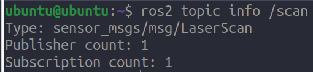
    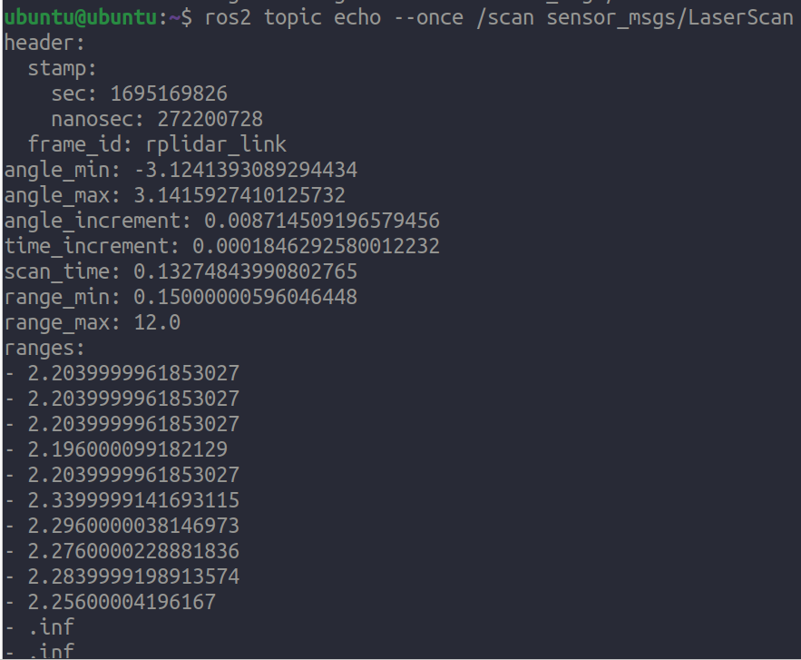
    <figcaption>angle increment: 0.000184629 radians = ~ 0.5 degrees </figcaption>
</figure>

1. Applications:
- Planar LiDARs are commonly used in robotics for obstacle detection and navigation.
- They're also used in certain autonomous vehicle systems, especially in scenarios where 2D profiling is adequate.
- Industries utilize planar LiDARs for safety systems, ensuring that machinery or automated platforms do not collide with obstacles.

1. Advantages and Limitations:
- Advantages: Planar LiDARs are typically simpler and less expensive than their 3D counterparts. They provide accurate distance measurements and can work in a variety of lighting conditions, including darkness.
- Limitations: They only capture data in a single plane, so they might miss obstacles that lie above or below this plane. For a more comprehensive understanding of the environment, 3D LiDAR systems or multiple planar LiDARs at different orientations might be required.

In summary, a planar LiDAR is a powerful tool for distance measurement and object detection in a 2D plane, with applications ranging from robotics to industrial safety systems.


## RPLIDAR A1

The RPLIDAR A1 is a popular 360-degree 2D laser scanner (LiDAR) developed by SLAMTEC. It's widely used in robotics, drones, and other applications for environmental scanning, mapping, and obstacle detection.

<figure class="aligncenter">
    
    <figcaption>RPLidar A1</figcaption>
</figure>

### **Key Features**:

- **360-degree Scanning**: The RPLIDAR A1 can perform a 360-degree scan of its environment, providing a comprehensive view of the surroundings.
- **Distance Range**: It typically offers a scanning range of up to 6 to 12 meters, depending on the specific model and environmental conditions.
- **Sampling Rate**: The device can capture up to 8000 samples per second, ensuring detailed and accurate scans.
- **Compact and Lightweight**: The RPLIDAR A1 is designed to be small and light, making it suitable for integration into robots, drones, and other devices.
- **Cost-Effective**: Compared to many LiDAR systems, the RPLIDAR A1 is relatively affordable.
- **Communication**: The device communicates via a UART interface.
- **Driver and SDK**: SLAMTEC provides drivers and an SDK, compatible with platforms including ROS.
- **Rotation Speed Control**: The rotation speed can be controlled programmatically.


<figure class="aligncenter">
    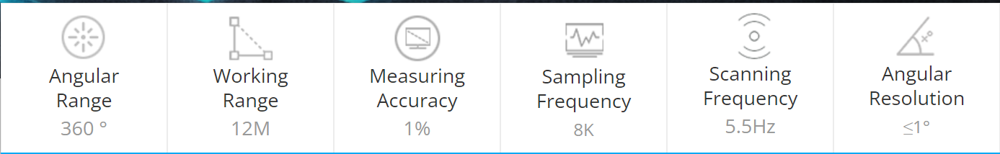
    <figcaption>RPLidar A1 specs </figcaption>
</figure>

[SEE rviz2 laser scan data here]("https://weber-agv.github.io/WSU-turtlebot4-user-manual/ros2_adv/rviz2.html")
---

# Assignment

## ROS2 Humble: Automatic Emergency Braking for TurtleBot 4

In this assignment, we will create a ROS2 package for the TurtleBot 4 robot to perform automatic emergency braking. The robot should stop at 0.5 meters from an obstacle in the front of it. Use proportional control to slowly stop the robot

## Steps:

### 1. Create a new ROS2 package

```bash
source /opt/ros/humble/setup.bash
mkdir -p ~/turtlebot4_aeb_ws/src
cd ~/turtlebot4_aeb_ws/src
ros2 pkg create turtlebot4_aeb --build-type ament_python --dependencies rclpy geometry_msgs
```

### 2. Write the node code

Open the package in vscode and add the aeb_node.py python file

```bash 
cd turtlebot4_aeb/turtlebot4_aeb
code .
```
Create the a new file under turtlebot4_aeb directory called aeb_node.py.  

```note
aeb_node.py should be in the following directory structure ``turtlebot4_aeb/turtlebot4_aeb/aeb_node.py`` It should be in the same file as the __init__.py
```

Edit `scripts/aeb_node.py`:

```python
#!/usr/bin/env python3

import rclpy
from rclpy.node import Node
from geometry_msgs.msg import Twist, Point
from sensor_msgs.msg import LaserScan

class AEBNode(Node):

    def __init__(self):
        super().__init__('aeb_node')
        # create a publisher for movement
        # create a subscriber for getting laser data

    def scan_callback(self, msg):
        # Let's assume that if an object is within 0.5 meters directly in front, we need to stop.
        # create logic for calling stop_robot
            
    def stop_robot(self):
        vel_msg = Twist()
        self.vel_publisher.publish(vel_msg)

def main(args=None):
    rclpy.init(args=args)
    node = AEBNode()
    rclpy.spin(node)
    node.destroy_node()
    rclpy.shutdown()

if __name__ == '__main__':
    main()
```

### 3. Modify the `setup.py` file

Edit the `setup.py` file in your package to ensure the node script is installed correctly:

```python
from setuptools import setup

package_name = 'turtlebot4_aeb'

setup(
    name=package_name,
    version='0.0.1',
    packages=[package_name],
    data_files=[
        ('share/ament_index/resource_index/packages',
                ['resource/' + package_name]),
        ('share/' + package_name, ['package.xml']),
    ],
    install_requires=['setuptools'],
    zip_safe=True,
    maintainer='Your Name',
    maintainer_email='your.email@example.com',
    description='TurtleBot 4 Automatic Emergency Braking',
    license='TODO: License declaration',
    tests_require=['pytest'],
    entry_points={
        'console_scripts': [
            'aeb_node = turtlebot4_aeb.scripts.aeb_node:main',
        ],
    },
)
```

### 4. Build and source the package

```bash
cd ~/turtlebot4_aeb_ws
colcon build --symlink-install
source install/setup.bash
```

### 5. Run the node

With your TurtleBot 4 running and publishing LaserScan messages, you can test the AEB node:

```bash
ros2 run turtlebot4_aeb aeb_node
```
