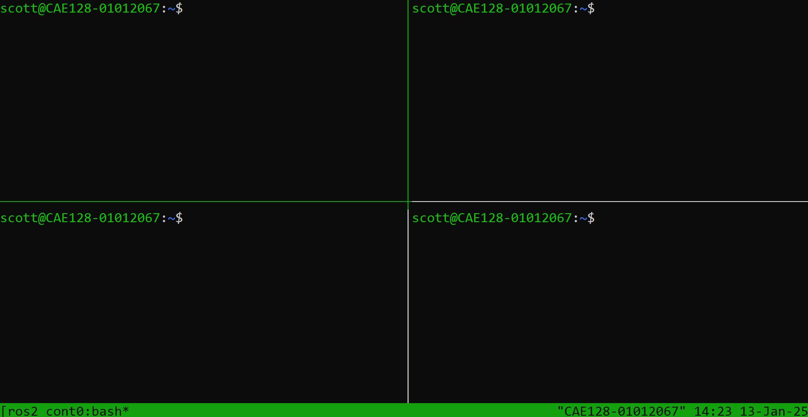

# Terminal Multiplexer

# Introduction to tmux for ROS 2

## What is tmux?

`tmux` (Terminal Multiplexer) helps you manage multiple terminal sessions from a single window. This is especially helpful when working with ROS 2, where you often need multiple nodes and tools running simultaneously.

---

## Learning Objectives

By the end of this tutorial, students will:

- Understand the purpose of `tmux` in robotics.
- Create and manage `tmux` sessions for ROS 2.
- Split and navigate panes efficiently.
- Save and restore `tmux` layouts for specific robot tasks.

---

## Getting Started

### Step 1: Installing tmux

Ensure `tmux` is installed on your system:

```bash
sudo apt update
sudo apt install tmux
```

### Step 2: Basic tmux Commands

Key `tmux` commands to remember (use `Ctrl+b` as the prefix):

| Command            | Action                              |
|--------------------|-------------------------------------|
| `Ctrl+b` then `%`  | Split window vertically.           |
| `Ctrl+b` then `"`  | Split window horizontally.         |
| `Ctrl+b` then arrow| Move between panes.                |
| `Ctrl+b` then `c`  | Create a new window.               |
| `Ctrl+b` then `n`  | Switch to the next window.         |
| `Ctrl+b` then `w`  | List all windows and switch.       |
| `Ctrl+b` then `d`  | Detach from the current session.   |

### Step 3: Creating a ROS 2 Workflow

#### Start a New tmux Session:

```bash
tmux new -s ros2_control
```

#### Split the Terminal into Panes:

- Press Ctrl+b, then % to split vertically.
- Press Ctrl+b, then " to split horizontally.
- Press Ctrl+b, then left arrow to move to the left pane
- Press Ctrl+b, then " to split horizontally.



#### Run ROS 2 Commands in Panes:
- Pane 1: Source your ROS 2 environment and run the ROS 2 daemon.

```bash
source /opt/ros/humble/setup.bash
ros2 daemon start
```

- Pane 2: Run a simulation or launch file.

```bash
source /opt/ros/humble/setup.bash
ros2 launch turtlesim turtlesim_node.launch.py
```

- Pane 3: Monitor ROS 2 topics.

```bash
source /opt/ros/humble/setup.bash
ros2 topic list
```

- Pane 4: Run teleop for controlling the robot.

```bash
source /opt/ros/humble/setup.bash
ros2 run turtlesim turtle_teleop_key
```

#### Name Windows for Clarity:
Rename the active window for better organization:
1. Press `Ctrl+b`, then `,`.
2. Enter a descriptive name like `ROS 2 Nodes` and press `Enter`.

#### Navigate Between Panes:
Use `Ctrl+b` and the arrow keys to move between panes.

---

### Step 4: Saving and Reattaching Sessions

#### Detach the tmux Session:
To return to your terminal without closing the session:

```bash
Ctrl+b, then d
```
#### Reattach the tmux Session:
To reattach to your saved session:

```bash
tmux attach-session -t ros2_control
```

#### List All tmux Sessions:
View all active tmux sessions:
```bash
tmux list-sessions
```

#### Kill a Session:
Close a session when it’s no longer needed:

```bash
tmux kill-session -t ros2_control
```

### Step 5: Practice Exercise

1. Start a new tmux session and set up the following:
   - **Pane 1**: Run `ros2 daemon start`.
     ```bash
     source /opt/ros/humble/setup.bash
     ros2 daemon start
     ```
   - **Pane 2**: Launch the `turtlesim` node.
     ```bash
     source /opt/ros/humble/setup.bash
     ros2 launch turtlesim turtlesim_node.launch.py
     ```
   - **Pane 3**: Use `ros2 topic list` to view available topics.
     ```bash
     source /opt/ros/humble/setup.bash
     ros2 topic list
     ```
   - **Pane 4**: Run `turtle_teleop_key` to control the turtle.
     ```bash
     source /opt/ros/humble/setup.bash
     ros2 run turtlesim turtle_teleop_key
     ```

2. Detach and reattach the session to ensure you understand how to manage it.

3. Practice naming your tmux windows and navigating between panes and windows.

---

### Recap

- `tmux` is a powerful tool for managing multiple terminal sessions, making it perfect for ROS 2 workflows.
- You can split windows, navigate panes, and save/restore sessions for better organization and efficiency.
- Use tmux to streamline your ROS 2 development process by organizing your nodes, tools, and monitoring commands.
