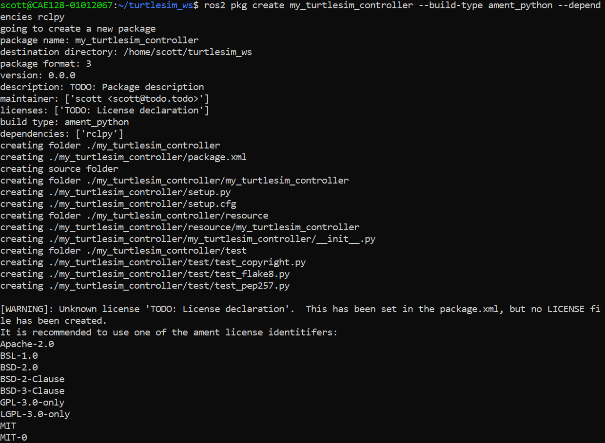
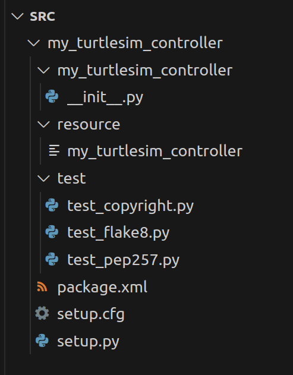
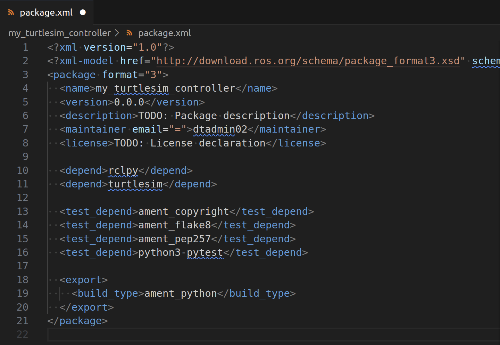
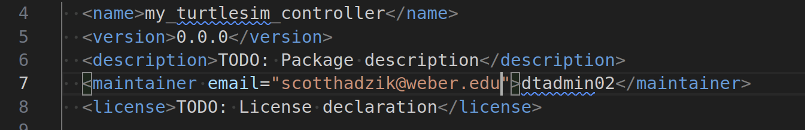
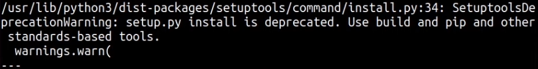
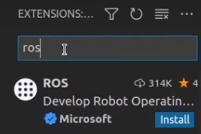

# Create and setup a Package

# What Is a ROS 2 Package?

A **ROS 2 package** is a modular unit of functionality in ROS 2 that contains everything needed to perform a specific task or provide a feature. Packages are the fundamental building blocks of ROS 2 applications and can include nodes, libraries, configuration files, launch files, and other resources.

---

## Key Components of a ROS 2 Package

1. **`package.xml`**:
   - Metadata file that describes the package (name, version, description, dependencies).
   - Used by build tools to resolve dependencies.

2. **`CMakeLists.txt`**:
   - Build configuration file for C++ or other compiled packages.
   - Specifies how the package should be built.

3. **`setup.py`**:
   - Python build script for Python-based packages.

4. **Source Code**:
   - Python scripts, C++ source files, or libraries implementing the package functionality.
   - Typically placed in a directory named after the package.

5. **Resources**:
   - Configuration files, message/service/action definitions, launch files, etc., necessary for the package's operation.

---

## What Makes a Package Special in ROS 2?

1. **Reusability**:
   - Packages are self-contained, making it easy to share and reuse them across different projects.

2. **Dependency Management**:
   - Packages declare their dependencies in `package.xml`, allowing tools like `colcon` to ensure everything needed is installed and built.

3. **Interoperability**:
   - ROS 2 packages can communicate with each other using topics, services, and actions, enabling modular system design.

4. **Scalability**:
   - Complex applications can be developed by combining multiple smaller, focused packages.

---

## How a Package Fits Into a Workspace

- A package resides in the `src/` directory of a ROS 2 workspace.
- It is built and installed into the workspace's `build/` and `install/` directories.
- After sourcing the workspace, the package's nodes, launch files, and resources become available for use.

---

## Example Use Case

If you are controlling a robot, you might have:
- A **sensor package** to process sensor data.
- A **control package** to compute actions.
- A **simulation package** to visualize the robot's behavior.

Each package would handle one aspect of the overall application.

---

In essence, a ROS 2 package is a self-contained module that organizes code, dependencies, and resources for a specific purpose, allowing you to build scalable and modular robotic applications.


## 1. Navigate to Your Workspace
Ensure you are in the workspace where you want to create the package:

```bash
cd ~/turtlesim_ws/src
```

## 2. Create the Package
Use the **ros2 pkg create** command to create the my_turtlesim_controller package:


```bash
ros2 pkg create my_turtlesim_controller --build-type ament_python --dependecies rclpy
```



## 3. Understand the Generated Files
The command creates the following structure:

```plaintext
my_turtlesim_controller/
├── CMakeLists.txt          # CMake build file (not used for Python packages)
├── package.xml             # Defines package metadata and dependencies
├── resource/               # Stores package-specific resources
│   └── my_turtlesim_controller  # Empty marker file for ament resource index
├── setup.py                # Python build script
└── my_turtlesim_controller/ # Directory for Python scripts
```

Open up the src in Visual Studio Code to view


```bash
cd ~/turtlsim_ws/src
code .
```



## 4. Add Dependencies
Edit `package.xml` to declare the package dependencies. For controlling turtlesim, include rclpy and turtlesim:

```xml
<depend>turtlesim</depend>
```



Add your email to the maintainer email line in `package.xml`



## 5. Colcon build

Navigate back to the turtlesim_ws directory

```bash
cd ~/turtlesim_ws
```

Use colcon build to the new package

```note
colcon build

 Identifies the packages in the src/ directory based on the presence of package.xml files.

Resolves dependencies, determines build order, and invokes the appropriate build system (e.g., CMake for C++ or setuptools for Python).
```

```bash
colcon build
```

If you get this error follow the instructions below



```bash
pip3 install setuptools==58.2.0
```


## 5. Write the Python Code
Create a Python script to control the turtle. 

In the terminal navigate to the `~/trutlesim_ws/src/my_turtlesim_controller/my_turtlesim_controller`

```bash
cd ~/trutlesim_ws/src/my_turtlesim_controller/my_turtlesim_controller
```

Create a file called node_turtle_controller.py

```bash
touch node_turtle_controller.py
```

Make the file executable

```bash
chmod +x node_turtle_controller.py
```
Go back to src and open it in vscode

```
cd ../..
code .
```

Install the ROS extension in vscode




This is the python code

```python
#!/usr/bin/env python3
import rclpy  # Import the ROS 2 Python client library
from rclpy.node import Node  # Import the Node base class for creating ROS 2 nodes
from geometry_msgs.msg import Twist  # Import the Twist message type for velocity commands

class TurtleController(Node):
    """
    A ROS 2 Node to control the turtle in turtlesim by publishing velocity commands.
    """
    def __init__(self):
        # Initialize the Node with the name 'turtle_controller'
        super().__init__('turtle_controller')
        
        # Create a publisher to the '/turtle1/cmd_vel' topic
        # This topic controls the turtle's linear and angular velocity in turtlesim
        # Queue size of 10 specifies how many messages to store if the subscriber is slower
        self.publisher = self.create_publisher(Twist, '/turtle1/cmd_vel', 10)
        
        #set up a timer in your ROS 2 node that calls the move_turtle method every 0.5 seconds.
        self.timer = self.create_timer(0.5, self.move_turtle)
        
        # Log a message indicating the node has been started
        self.get_logger().info('Turtle Controller Node has started.')

    def move_turtle(self):
        """
        Publishes a velocity command to make the turtle move.
        """
        # Create a Twist message to define linear and angular velocities
        twist = Twist()
        twist.linear.x = 2.0  # Set forward velocity to 2.0 units/second
        twist.angular.z = 1.0  # Set rotational velocity to 1.0 radians/second
        
        # Publish the Twist message to the '/turtle1/cmd_vel' topic
        self.publisher.publish(twist)
        
        # Log the published velocity command
        self.get_logger().info('Published velocity command.')

def main(args=None):
    """
    Main function to initialize the ROS 2 system and run the TurtleController node.
    """
    # Initialize the ROS 2 Python client library
    rclpy.init(args=args)
    
    # Create an instance of the TurtleController node
    node = TurtleController()
    try:
        # Publish an initial velocity command and keep the node running
        node.move_turtle()
        rclpy.spin(node)  # Keep the node active and responsive
    except KeyboardInterrupt:
        # Gracefully handle Ctrl+C to stop the node
        pass
    finally:
        # Clean up the node before shutting down
        node.destroy_node()
        rclpy.shutdown()

if __name__ == '__main__':
    # Entry point of the script
    main()

```

## 6. Update `setup.py`
Update the `setup.py` file to make your script executable. Modify the `entry_points` section:

```python
entry_points={
    'console_scripts': [
        'turtle_controller = my_turtlesim_controller.turtle_controller:main',
    ],
},
```

## 7. Build the Package
Navigate back to the root of the workspace and build your package:

```bash
cd ~/turtlesim_ws
colcon build --packages-select my_turtlesim_controller
```

```note
If you do colcon build --symlink-intall you won't have to do colcon build after every time you modify the python file
```

## 8. Source the Workspace
Source the workspace to make the package available:

```bash
source ~/turtlesim_ws/install/setup.bash
```

```note
If you have added source ~/turtlesim_ws/install/setup.bash to your .bashrc then you can just source ~/.bashrc
```


## 9. Test the my_turtlesim_controller Node
Launch the turtlesim node in one terminal:

```bash
ros2 run turtlesim turtlesim_node
```

In another terminal, run your controller node:

```bash
ros2 run my_turtlesim_controller turtle_controller
```

In another terminal, run a topic echo for cmd_vel

```bash
ros2 topic echo /turtle1/cmd_vel
```

In another terminal, run rqt_graph

```bash
rqt_graph
```

The turtle should move in a circular motion based on the linear and angular velocities you defined.