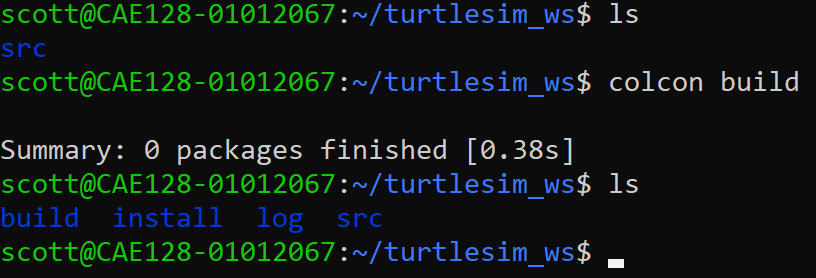

# Create `turtlesim_ws` Workspace ROS 2

The following steps guide you to create a ROS 2 workspace named `turtlesim_ws` and include the `turtlesim` package for running a simple simulation.

---

## 1. Set Up the Workspace Directory

Open a terminal and create the workspace directory structure:

```bash
mkdir -p ~/turtlesim_ws/src
cd ~/turtlesim_ws
```
## 2. Add the `turtlesim` Package

The `turtlesim` package is part of the ROS 2 distribution and can be cloned or installed directly:

### Option 1: Install Using `apt`

## 2. For most ROS 2 distributions, you can install `turtlesim`:

```bash
sudo apt update
sudo apt install ros-humble-turtlesim
```
This installs the turtlesim package system-wide on your machine.

No change to the structure of the turlesim_ws workspace


## 3. Build the Workspace

Navigate to the workspace root directory and build the packages:

```bash
cd ~/turtlesim_ws
colcon build
```



#### What Does `colcon build` Do?

The `colcon build` command is used to build all the packages in a ROS 2 workspace. It automates the build process by managing dependencies, generating build artifacts, and installing outputs. Here's a breakdown of what happens during the `colcon build` process:

---

#### 1. Initialize the Build Process
- **Workspace Detection**: Colcon identifies the workspace by finding the `src/` directory containing ROS 2 packages.
- **Package Discovery**: Colcon scans the `src/` directory to locate all ROS 2 packages (defined by `package.xml` files).

---

#### 2. Dependency Analysis
- **Dependency Graph**: Colcon examines the dependencies of each package based on its `package.xml` file and builds a dependency graph.
- **Build Order**: Packages are built in an order that satisfies their dependencies. For example, if Package A depends on Package B, Package B will be built first.

---

#### 3. Invoke Build Systems
- **Build Tool Selection**: Colcon identifies the build system used by each package (e.g., CMake, Python setuptools).
  - **CMake Packages**: Runs `cmake` to configure the package, followed by `make` or equivalent to compile it.
  - **Python Packages**: Uses `setuptools` to build Python packages.
- **Parallel Builds**: By default, Colcon builds packages in parallel when there are no dependency conflicts.

---

#### 4. Generate Build Artifacts
- **`build/` Directory**: Contains intermediate build files such as compiled binaries, object files, and configuration data.
- **`install/` Directory**: Stores the final build outputs (e.g., executables, shared libraries, Python modules, and ROS message/service definitions).
- **`log/` Directory**: Captures logs for each step of the build process, useful for debugging build issues.

---

#### 5. Environment Setup
- Colcon generates the necessary setup files (`setup.bash`, `setup.zsh`, `local_setup.bash`) in the `install/` directory.
- These files allow your workspace's packages to be sourced and used in the ROS 2 environment.

---

#### 6. Post-Build Steps
- Colcon validates the build process to ensure all steps completed successfully.
- If a package fails to build, Colcon provides logs and skips dependent packages (to prevent cascading failures).

---

#### Key Features of `colcon build`
1. **Modular Build**:
   - Each package is built independently, reducing the impact of build failures.
   
2. **Incremental Builds**:
   - Only packages that have been modified or whose dependencies have changed are rebuilt.

3. **Build Profiles**:
   - Supports different profiles (e.g., `Debug`, `Release`) for optimized or debug builds.

---

#### Common Command Options
- **`--packages-select <package_name>`**: Build only specified packages.
- **`--packages-ignore <package_name>`**: Skip specific packages during the build.
- **`--parallel-workers <N>`**: Control the number of parallel build jobs.
- **`--event-handlers console_cohesion+`**: Improve the console output format for better readability.

---

By using `colcon build`, you automate the process of compiling and installing your ROS 2 packages, ensuring that all dependencies are correctly resolved and that the workspace is ready for use.

## 4. Source the Workspace
After the build is complete, source the workspace to use the installed packages:

```note
We don't currenty have a package for this workspace yet. We will be creating one shortly

```

```bash
source ~/turtlesim_ws/install/setup.bash
```

To make this permanent, add it to your .bashrc:

```bash
echo "source ~/turtlesim_ws/install/setup.bash" >> ~/.bashrc
source ~/.bashrc
```


## Summary of What a Workspace Is in ROS 2
A ROS 2 workspace is a directory structure used to organize and manage ROS 2 packages. It serves as the development environment where you store, build, and work with packages that are part of your ROS 2 project. A workspace includes several directories and components, each with a specific purpose: