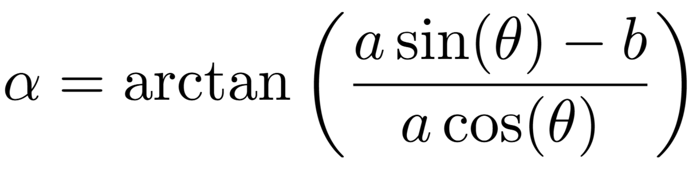
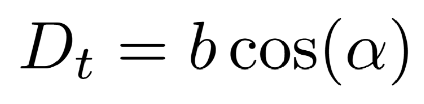

# Wall Following
---

## Using LiDAR to Determine Distance from a Wall

LiDAR (Light Detection and Ranging) is an essential tool for many robotics projects, especially for navigation and obstacle avoidance. One of its common applications is to determine how far a robot is from a wall.

The image below show a generic orientation of a car in relationship to a wall on it's right side. 

- The angle between the car's x axis and the wall is denoted by &alpha;.
- The scan data on line `b` corresponds to the x axis of the car
- The scan data on line `a` corresponds to an angle &theta; from line `b`. 
- The angle &theta; should range from 0 to 70 degrees relative to line `a`.
- `a` and `b` will be distances returned by the `/scan` data

<figure class="aligncenter">
    
    <figcaption>Wall Following</figcaption>
</figure>

Using the two distances `a` and `b` from `/scan`, the angle &theta; between the laser scans, and trigonometry, we can express &alpha; as

<!-- <figure class="aligncenter">
    
    <figcaption>Calculation to find &alpha</figcaption>
</figure> -->

Using the value for &alpha; we can determine Dt as

Dt is the current distance between the car and the right wall.
<!-- 
<figure class="aligncenter">
    
    <figcaption>Dt calculation</figcaption>
</figure> -->

The error term e(t) is the difference between the desired distance and the actual distance. If the desired distance from the wall is 0.5 meters then e(t) = 0.5 - Dt

## Calculating Future distance

Yet, there's an obstacle to consider. The robots velocity will move it to some future point prior to the motors reacting to the turn required. If our strategy depends just on the present distance to the wall, we risk making turns too late, potentially leading to accidents. It's crucial, then, to anticipate the car's path by projecting a certain lookahead distance, termed `L`. Consequently, our updated distance becomes Dt+1 = Dt + `L`sin(&alpha)

<figure class="aligncenter">
    
    <figcaption>Wall Following with Error in Position</figcaption>
</figure>

# Lab 3 - Wall Following

**Tips**
- get `scan` data for two vectors `a` and `b`
- `b` is the x axis of the robot
- `a` is &theta; degrees from `b`
- &theta; should be no more than 70 degrees
- use `a` and `b` to calculate &alpha;
- use &alpha; to calculate Dt
- use &alpha; and Dt to estimate future distance from wall Dt+1
- use Dt+1 to adjust the robot position from the wall
- use PID to smooth out the robot as it moves along the wall

## Learning Outcomes:

By the end of this assignment:

- Students will have a comprehensive understanding of PID control and its application in ground vehicle systems.
- Students will design and implement an algorithm that allows the TurtleBot 4 to autonomously follow walls in its environment.

## Assignment Rubric:

| Criteria                                                               | Points      |
|------------------------------------------------------------------------|-------------|
| Understanding and application of PID control in the wall-following algorithm | 30 points   |
| Successful demonstration of TurtleBot 4 autonomously following walls   | 30 points   |
| Robustness of the algorithm in diverse scenarios (e.g., corners, obstacles) | 20 points   |
| Code submission and documentation                                      | 15 points   |
| Provided video evidence showcasing the robot's performance             | 5 points    |

## Submission:

Please ensure you submit both your code (in Python or C++) and the video of the robot performing wall following.

Additional Resources

